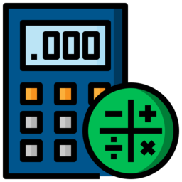
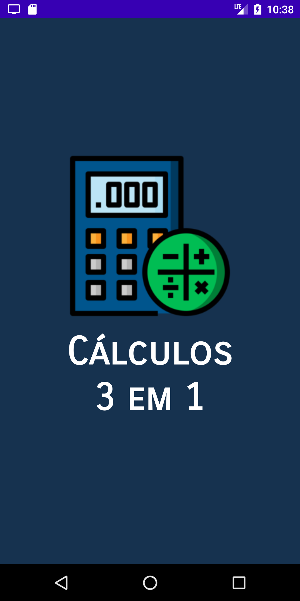
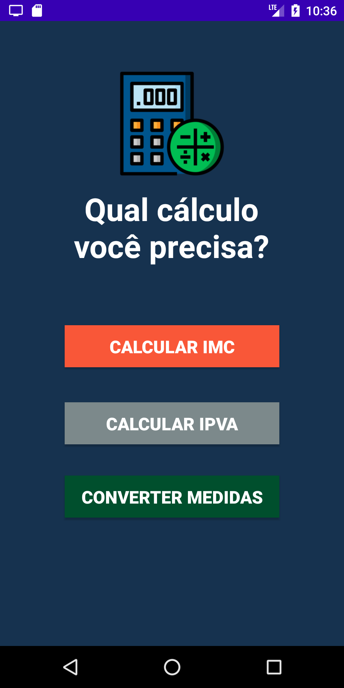
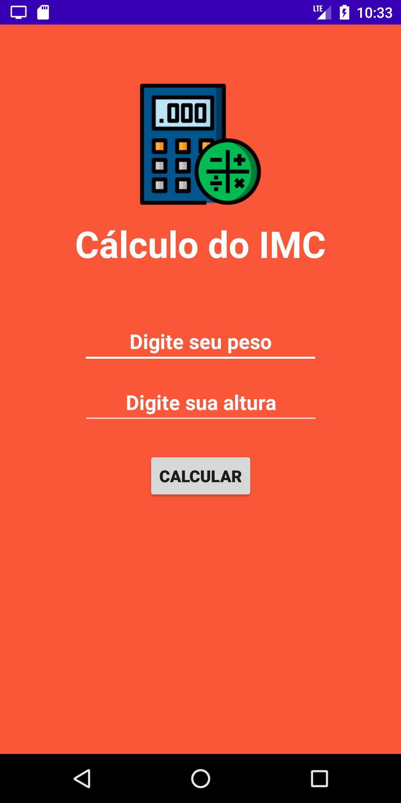
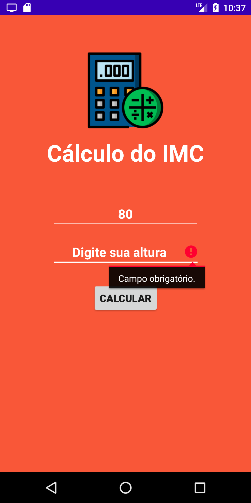
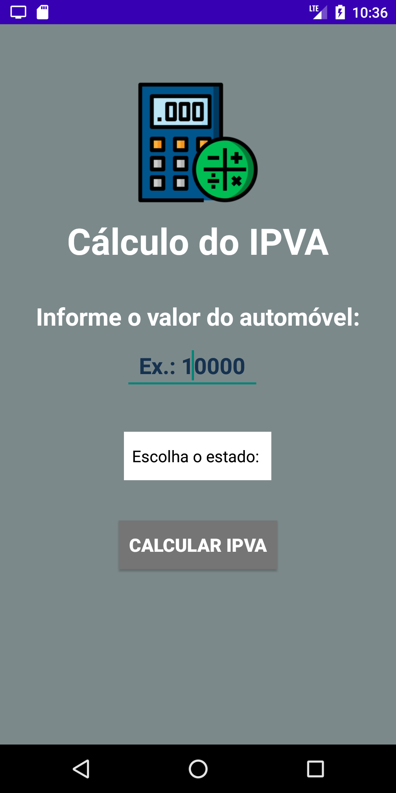
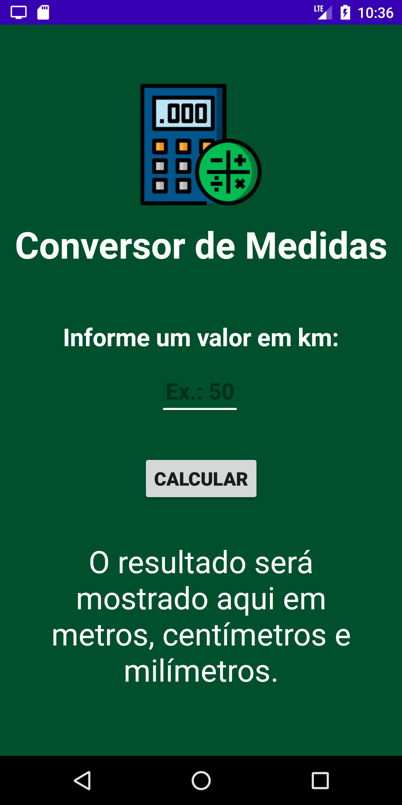

# Cálculos 3 em 1   

 

 

Este é um aplicativo Android que oferece três tipos de cálculos: calcular o IMC, calcular o valor do IPVA e converter medidas. Esse app foi desenvolvido como atividade final do curso "Desenvolvimento de Aplicativos - Android Kotlin", disponibilizado gratuitamente pela escola Cellep em parceria com o Facebook.
Mais informações sobre esse e outros cursos oferecidos pela Cellep, você pode consultar neste link: https://br.cellep.com/estacaohack/

 

 

## :camera: Imagens da aplicação

 

 

 

  

 

## :man_technologist: Tecnologias e ferramentas utilizadas:

- Kotlin
- Android Studio

 

## :computer: Rodando o projeto no seu computador:

Para rodar e/ou editar essa aplicação em seu computador, é necessário ter o Android Studio instalado e configurado. Orientações sobre como instalar o Android Studio, você encontra no site Developer Android: https://developer.android.com/studio/install?hl=pt-br

 

  

Made with 🧡 and :coffee: | Find me on <a href="https://www.linkedin.com/in/vivianebresolin/"> LinkedIn</a>

